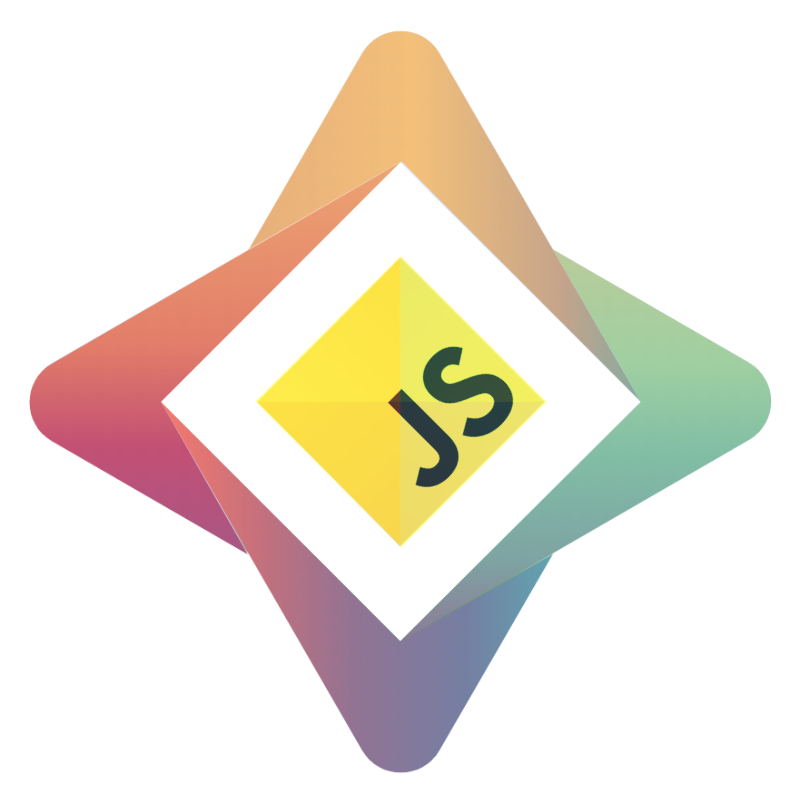

<!-- ALL-CONTRIBUTORS-BADGE:START - Do not remove or modify this section -->
[](#contributors-)
<!-- ALL-CONTRIBUTORS-BADGE:END -->


<!-- ALL-CONTRIBUTORS-BADGE:START - Do not remove or modify this section -->

[](#contributors-)

<!-- ALL-CONTRIBUTORS-BADGE:END -->

# Syft.js

Syft.js is the “web” part of the [OpenMined](https://openmined.org)'s open-source ecosystem for [federated learning](https://ai.googleblog.com/2017/04/federated-learning-collaborative.html),
which currently spans across web, [iOS](https://github.com/OpenMined/SwiftSyft), [Android](https://github.com/OpenMined/KotlinSyft), and [servers/IoT](https://github.com/OpenMined/PySyft).

Syft.js has following core features:

- :hammer_and_wrench: Integration with PyGrid federated learning API.
- :gear: **Training and inference** of any PySyft model written in PyTorch or TensorFlow.
- :bust_in_silhouette: Allows all data to stay on the user's device.
- :lock: Support for **secure multi-party computation** and **secure aggregation** protocols using **peer-to-peer WebRTC** connections (_in progress_).

The library is built on top of [TensorFlow.js](https://js.tensorflow.org/).

There are a variety of additional privacy-preserving protections that may be applied, including [differential privacy](https://towardsdatascience.com/understanding-differential-privacy-85ce191e198a), [muliti-party computation](https://www.inpher.io/technology/what-is-secure-multiparty-computation), and [secure aggregation](https://research.google/pubs/pub45808/).

If you want to know how scalable federated systems are built, [Towards Federated Learning at Scale](https://arxiv.org/pdf/1902.01046.pdf) is a fantastic introduction!

## Installation

_We have not currently made our initial release. Syft.js would soon be available via npm._

Meanwhile, you can install syft.js directly from Github.
Note that syft.js needs Tensorflow.js library as peer dependency.

If you're using a package manage like NPM:

```text
npm install --save https://github.com/OpenMined/syft.js @tensorflow/tfjs-core
```

Or if Yarn is your cup of tea:

```text
yarn add https://github.com/OpenMined/syft.js @tensorflow/tfjs-core
```

If you're not using a package manager, you will be able to include Syft.js within a `<script>` tag **when it's released**.

```html
<script src="https://cdn.jsdelivr.net/npm/@tensorflow/tfjs@1.2.5/dist/tf.min.js"></script>
<script src="https://cdn.jsdelivr.net/npm/@openmined/syft.js@latest/dist/index.js"></script>
```

## Quick Start

As a developer, there are few steps to building your own secure federated learning system upon the OpenMined infrastructure:

1. :robot: Develop ML model and training procedure (aka `Plan` in PySyft terminology) using [PySyft](https://github.com/OpenMined/PySyft). By design, PySyft is built upon PyTorch and TensorFlow so you **don't need to learn a new ML framework**.
1. :earth_americas: Host model and Plans on [PyGrid](https://github.com/OpenMined/PyGrid), which will deal with all the federated learning components of your pipeline.
1. :tada: Execute the training on the variety of end-user devices using the client library (syft.js, [SwiftSyft](https://github.com/OpenMined/SwiftSyft), [KotlinSyft](https://github.com/OpenMined/KotlinSyft), [PySyft](https://github.com/OpenMined/PySyft)).
1. :lock: Securely aggregate trained user models in PyGrid.

**:notebook: The entire workflow and process is described in greater detail in the [Web & Mobile Federated Learning project roadmap](https://github.com/OpenMined/Roadmap/blob/master/web_and_mobile_team/projects/federated_learning.md).**

Syft.js provides minimalistic API to communicate with federated learning PyGrid endpoints
and execute PySyft's Plans in a browser.
The federated learning cycle implemented with syft.js would contain following steps:

- Register into training cycle on PyGrid.
- Download required model and Plans from PyGrid.
- Execute the Plan with given model parameters and local user's data.
- Submit difference between original and trained model parameters for aggregation.

This whole cycle can be expressed in the following code:

```javascript
import * as tf from '@tensorflow/tfjs-core';
import { Syft } from '@openmined/syft.js';

const gridUrl = 'ws://pygrid.myserver.com:5000';
const modelName = 'my-model';
const modelVersion = '1.0.0';

// if the model is protected with authentication token (optional)
const authToken = '...';

const worker = new Syft({ gridUrl, authToken, verbose: true });
const job = await worker.newJob({ modelName, modelVersion });
job.start();

job.on('accepted', async ({ model, clientConfig }) => {
  const batchSize = clientConfig.batch_size;
  const lr = clientConfig.lr;

  // Load data.
  const batches = LOAD_DATA(batchSize);

  // Load model parameters.
  let modelParams = model.params.map(p => p.clone());

  // Main training loop.
  for (let [data, labels] of batches) {
    // NOTE: this is just one possible example.
    // Plan name (e.g. 'training_plan'), its input arguments and outputs depends on FL configuration and actual Plan implementation.
    let updatedModelParams = await job.plans['training_plan'].execute(
      job.worker,
      data,
      labels,
      batchSize,
      lr,
      ...modelParams
    );

    // Use updated model params in the next iteration.
    for (let i = 0; i < modelParams.length; i++) {
      modelParams[i].dispose();
      modelParams[i] = updatedModelParams[i];
    }
  }

  // Calculate & send model diff.
  const modelDiff = await model.createSerializedDiff(modelParams);
  await job.report(modelDiff);
});

job.on('rejected', ({ timeout }) => {
  // Handle the job rejection, e.g. re-try after timeout.
});

job.on('error', err => {
  // Handle errors.
});
```

Note that syft.js doesn't handle user's data collection, data storage and loading.

### API Documentation

See [API Documentation](API-REFERENCE.md) for complete reference.

## Running the Demo App

The “Hello World” syft.js demo is MNIST training example located in `examples/mnist` folder.
It demonstrates how a simple neural net model created in PySyft can be trained in a browser
and the result of training averaged from multiple federated learning participants.


Running the demo is multi-stage and multi-component process
(as the federated learning itself ;-)).

Below are example instructions that assume you
want to put everything under `~/fl-demo` folder.

### Installation

First, you will need to install following packages.
It is recommended that you install python packages in separate virtualenv or conda environment, e.g.:

```bash
virtualenv -p python3 syft
source syft/bin/activate
```

or

```bash
conda create -n syft python=3.7
conda activate syft
```

#### Install PySyft

Get the latest `master` branch of PySyft:

```bash
cd ~/fl-demo
git clone https://github.com/OpenMined/PySyft
cd PySyft
pip install .
```

#### Install PyGrid

Get the latest `dev` branch of PyGrid:

```bash
cd ~/fl-demo
git clone https://github.com/OpenMined/PyGrid
cd PyGrid
git checkout dev
```

_NOTE_: currently it's required to replace

```text
syft==0.2.6
```

with

```text
git+git://github.com/OpenMined/PySyft#egg=syft
```

in `pip-dep/requirements.txt` file in PyGrid root folder.

Then continue with install:

```
pip install .
```

#### Install Syft.js with MNIST demo

Get the latest `master` branch of syft.js with MNIST demo app included:

```bash
cd ~/fl-demo
git clone https://github.com/OpenMined/syft.js
cd syft.js
npm install
cd examples/mnist
npm install
```

#### Seeding the Model & Plan

Syft.js connects to PyGrid to pick up the model and training Plan.
For the demo to work, we need to populate that data into PyGrid.

##### Run PyGrid

There're two possible ways to start PyGrid:

- Run `./dev_server.sh` script in the PyGrid root folder.
- Run `docker-compose up --build` in the PyGrid root folder.

Here we assume you don't need to change default PyGrid configuration and it listens
on the `localhost:5000`. If you need to use different host/port,
PyGrid URL will need to be adjusted accordingly in further steps.

##### Create Model & Plan

After the PyGrid is running, the next step is to create the model and training plan and host them in the PyGrid.
PySyft tutorials include MNIST example jupyter notebooks that guide you through this process.

Fire up jupyter notebook:

```bash
cd ~/fl-demo/PySyft
jupyter notebook --notebook-dir=$(pwd)
```

In the console, you should see URL you should open, or the browser will open automatically.
Inside the browser, navigate to `examples/experimental/FL Training Plan` folder in PySyft root.

There should be two notebooks of interest:

- _Create Plan_: In this notebook the MNIST model and training plan are defined and saved into files.
  Run all cells to get files created.

- _Host Plan_: Model and plan files created in the previous notebook are hosted in PyGrid.
  Run all cells to seed that data into PyGrid instance.

##### PyGrid Clean-up

In case you need to reset PyGrid database to blank state, stop the process with `Ctrl+C` and remove `databasegateway.db` file in PyGrid root folder.
Or, if you used docker-compose, stop and re-start it using `docker-compose up --force-recreate` command.

#### Starting the Demo

Finally, we got to the browser part of the demo:

```bash
cd ~/fl-demo/syft.js/examples/mnist
npm start
```

This should start development server and open `localhost:8080` in the browser.
Assuming PyGrid URL, MNIST model name and version were not modified in previous steps, just
press “Start FL Worker”.

You should see following in dev console:

- Syft.js registers into training cycle on PyGrid and gets configuration, Plan, and the model.
- App loads MNIST dataset and executes the training plan with each data batch.
  Charts are updated during this process, and you should see the training loss going down and the accuracy going up.
- After the training is complete, model diff is submitted to PyGrid.

If “Keep making cycle requests” is checked,
the whole cycle process is repeated until PyGrid tells worker that model training is complete.
It should be visible that
PyGrid aggregates each 3 submissions into the global model, so each 3rd starts
with lower loss and higher accuracy.

## Compatibility

### Tensorflow.js Versions Compatibility

Syft.js was tested with Tensorflow.js v1.2.5.

### Browser Support

syft.js was tested with Chrome and Firefox browsers.

## Contributing

Please check [open issues](https://github.com/OpenMined/syft.js/issues) as a starting point.

Bug reports and feature suggestions are welcomed as well.

The workflow is usual for github, the `master` branch is considered stable:

1. Star, fork, and clone the repo.
1. Create new branch for your changes.
1. Push changes in your fork.
1. Submit a PR to OpenMined/syft.js.
1. PR is reviewed and accepted.

Read the [contribution guide](https://github.com/OpenMined/.github/blob/master/CONTRIBUTING.md) as a good starting place.
Additionally, we welcome you to the [slack](http://slack.openmined.org/) for queries related to the library and contribution in general.
The Slack channel `#lib_syft_js` is specific to syft.js development. See you there!

## Contributors

These people were integral part of the efforts to bring syft.js to fruition and in its active development.
<!-- ALL-CONTRIBUTORS-LIST:START - Do not remove or modify this section -->
<!-- prettier-ignore-start -->
<!-- markdownlint-disable -->
<table>
  <tr>
    <td align="center"><a href="https://www.patrickcason.com"><br /><sub><b>Patrick Cason</b></sub></a><br /><a href="#ideas-cereallarceny" title="Ideas, Planning, & Feedback">🤔</a> <a href="https://github.com/OpenMined/syft.js/commits?author=cereallarceny" title="Code">💻</a> <a href="#design-cereallarceny" title="Design">🎨</a> <a href="https://github.com/OpenMined/syft.js/commits?author=cereallarceny" title="Documentation">📖</a> <a href="#business-cereallarceny" title="Business development">💼</a></td>
  </tr>
</table>

<!-- markdownlint-enable -->
<!-- prettier-ignore-end -->
<!-- ALL-CONTRIBUTORS-LIST:END -->

<!-- ALL-CONTRIBUTORS-LIST:START - Do not remove or modify this section -->
<!-- prettier-ignore-start -->
<!-- markdownlint-disable -->

<!-- markdownlint-enable -->
<!-- prettier-ignore-end -->

<!-- ALL-CONTRIBUTORS-LIST:END -->

## License

[Apache License 2.0](https://choosealicense.com/licenses/apache-2.0/)
