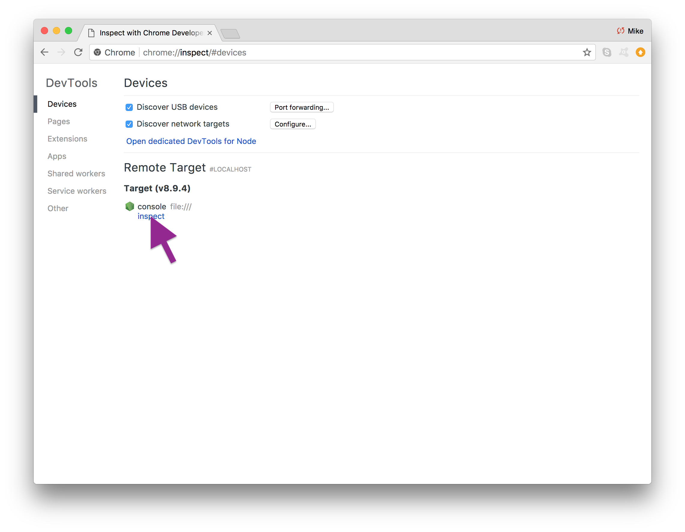

# Interactive Console
Use NodeJS and Chrome Inspector as an interactive console to play around with syft.js.

## Prerequisites
  - [Setup Open Mined Unity Project]()
  - [Setup Syft.js Repo](setup.md)

# Step 1
Run the Open Mined Unity Project.


# Step 2
Open a Terminal window and negative to the `syft.js` repo.

# Step 3
Run node in inspect mode.
```
$ node --inspect console
```


# Step 4
Open Chrome and negative to `chrome://inspect`,
then click on *inspect* near `path/to/syft.js`.


# Step 5
Explore Test and Play around with `syft.js`.

