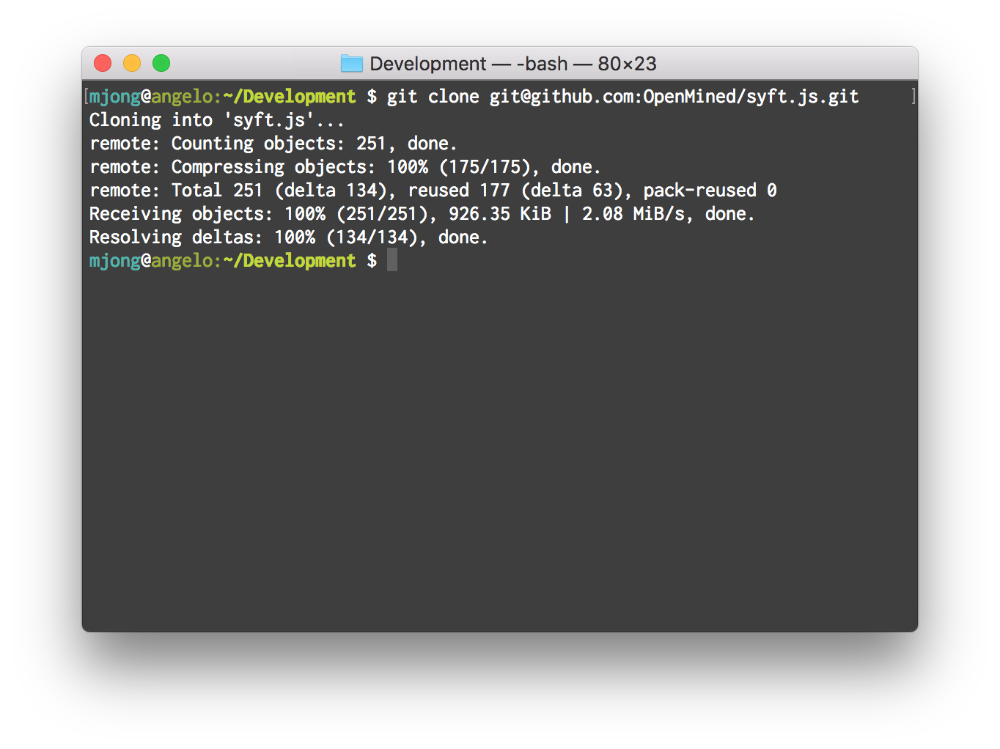
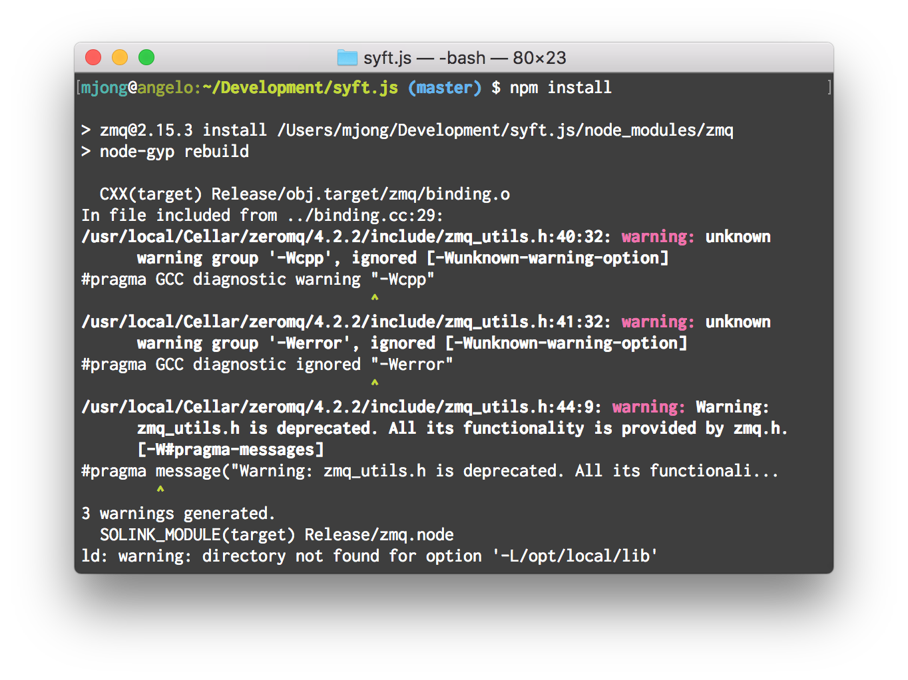

# Setup Syft.js
Setup the repo.

## Prerequisites
  - [Install NodeJS v8 or higher](https://nodejs.org)

# Step 1
Visit [OpenMined/syft.js](https://github.com/OpenMined/syft.js) and copy clone link.


# Step 2
Open a Terminal window and negative to where you want to clone the repo
```
$ git clone git@github.com:OpenMined/syft.js.git
```


# Step 3
Navigate to the `syft.js` directory.
```
$ cd syft.js
```

# Step 4
Install dependancies
```
$ npm install
```

